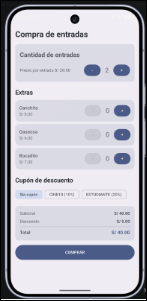

# Introducción al Desarrollo de Nuevas Plataformas - Jetpack Compose

<p align="center">
  
</p>

---

### **ELABORADO POR:**
- Garambel Marin Fernando
- Mollo Chuquicaña Dolly Yadhira
- Luque Condori Luis
- Hancco Mullisaca Sergio
- Suclle Suca Michael Benjamin

**DOCENTE:**  
Ernesto Mauro Suarez Lopez  

**AREQUIPA – PERÚ**  
**2026**

---

## 1. Introducción
El presente proyecto consiste en el desarrollo de una aplicación móvil para Android utilizando **Jetpack Compose**. La aplicación simula la compra de entradas de cine, permitiendo al usuario seleccionar la cantidad de boletos, agregar extras (como canchita o bebida) y aplicar cupones de descuento.

A diferencia de versiones anteriores donde todo el código se escribía en un solo archivo, este proyecto implementa la arquitectura **MVVM (Model-View-ViewModel)**, que separa la lógica de negocio de la interfaz de usuario, haciendo que el código sea más limpio, escalable y fácil de mantener.

---

## 2. Arquitectura del Proyecto
El proyecto está dividido en tres capas principales:

### 2.1. Capa de Datos (Model)
Contiene las clases de datos que representan la información de la aplicación.
- **Extra.kt**: Define los objetos que se pueden agregar a la compra (ej. Canchita).
- **Cupon.kt**: Define los cupones de descuento (ej. CINE10).
- **Constantes**: Archivo donde se definen los precios base y las listas de extras y cupones disponibles.

### 2.2. Capa de Lógica (ViewModel)
Es el "cerebro" de la aplicación. Contiene la clase `CompraDeEntradasViewModel`.
- Utiliza **StateFlow** para mantener el estado de la compra.
- Contiene las funciones para incrementar/decrementar entradas, agregar/quitar extras, y seleccionar cupones.
- **Importante:** La UI (la pantalla) no hace cálculos matemáticos. Solo le pide los datos al ViewModel y los muestra.

### 2.3. Capa de Interfaz (View)
Es la pantalla que ve el usuario (`MainActivity.kt`).
- Utiliza funciones `@Composable` para dibujar los elementos (Textos, Botones, Tarjetas).
- Se conecta al ViewModel mediante `collectAsState()`, lo que significa que si los datos en el ViewModel cambian, la pantalla se actualiza automáticamente.

---

## 3. Flujo de Funcionamiento
1. El usuario presiona el botón `+` en la pantalla.
2. La pantalla llama a la función `viewModel.incrementarEntradas()`.
3. El ViewModel actualiza el estado interno (`cantidadEntradas`).
4. Compose detecta el cambio en el estado, vuelve a leer el código de la pantalla y actualiza los textos del **Subtotal** y **Total** de forma automática y reactiva, sin necesidad de recargar la pantalla.

---

## 4. Código Principal
A continuación, se presentan los fragmentos más importantes del proyecto.

### 4.1. El ViewModel (Lógica de la App)
```kotlin
package com.example.compra_de_entradas.data

import androidx.lifecycle.ViewModel
import kotlinx.coroutines.flow.MutableStateFlow
import kotlinx.coroutines.flow.StateFlow
import kotlinx.coroutines.flow.asStateFlow
import kotlinx.coroutines.flow.update

class CompraDeEntradasViewModel : ViewModel() {
    private val _uiState = MutableStateFlow(CompraUiState())
    val uiState: StateFlow<CompraUiState> = _uiState.asStateFlow()

    fun incrementarEntradas() {
        _uiState.update { state ->
            if (state.cantidadEntradas < MAX_CANTIDAD) {
                state.copy(cantidadEntradas = state.cantidadEntradas + 1)
            } else {
                state
            }
        }
    }
    // ... (Resto de funciones para extras y cupones)
}
```

### 4.2. La Pantalla Principal (Interfaz de Usuario)
```kotlin
package com.example.compra_de_entradas

import androidx.compose.foundation.layout.*
import androidx.compose.material3.*
import androidx.compose.runtime.*
import androidx.compose.ui.Modifier
import androidx.compose.ui.unit.dp
import androidx.lifecycle.viewmodel.compose.viewModel

class MainActivity : ComponentActivity() {
    override fun onCreate(savedInstanceState: Bundle?) {
        super.onCreate(savedInstanceState)
        setContent {
            Compra_De_EntradasTheme {
                CompraScreen()
            }
        }
    }
}

@Composable
fun CompraScreen(viewModel: CompraDeEntradasViewModel = viewModel()) {
    val uiState by viewModel.uiState.collectAsState()

    // Scaffold nos da la estructura básica de la pantalla
    Scaffold { innerPadding ->
        Column(
            modifier = Modifier
                .fillMaxSize()
                .padding(innerPadding)
                .verticalScroll(rememberScrollState())
                .padding(16.dp),
            verticalArrangement = Arrangement.spacedBy(16.dp)
        ) {
            // Aquí se dibujan las tarjetas de Entradas, Extras, Cupones y Totales
            // ...
        }
    }
}
```

---

## 5. Conclusiones
- **Reactividad:** Compose es increíblemente poderoso. Al separar la lógica en un ViewModel, evitamos que la pantalla se sature de código y hacemos que los cálculos sean más precisos.
- **Manejo de Estado:** El uso de `StateFlow` y `MutableStateFlow` es el estándar moderno para manejar datos en Android. Nos permite sobrevivir a cambios de configuración (como girar el celular) sin perder la información.
- **Modularidad:** Tener archivos separados para los datos (`Cupon.kt`, `Extra.kt`) facilita enormemente la lectura y el trabajo en equipo.

---

## 6. Referencias
- Android Developers. (2024). *Guide to app architecture*. [https://developer.android.com/topic/architecture](https://developer.android.com/topic/architecture)
- Android Developers. (2024). *Kotlin flows on Android*. [https://developer.android.com/kotlin/flow](https://developer.android.com/kotlin/flow)
- Android Developers. (2024). *State and Jetpack Compose*. [https://developer.android.com/develop/ui/compose/state](https://developer.android.com/develop/ui/compose/state)
- Android Developers. (2024). *ViewModel overview*. [https://developer.android.com/topic/libraries/architecture/viewmodel](https://developer.android.com/topic/libraries/architecture/viewmodel)
- Material Design. (2024). *Material Design 3 Components*. [https://m3.material.io/components](https://m3.material.io/components)